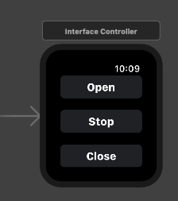

# Smart Gate IOS App

## Description

IOS app controls the <a href = "https://github.com/MitchTODO/Smart-driveway-gate">smart-drive-way-gate</a>

## Disclaimer

As the source code creator, I'm not labile for damages done to personal property or persons. USE AT YOUR OWN RISK.

## Storyboard

Story board consists of two views. Default view-controller contains three buttons, a label and toolbar with a single edit button. SettingsView view controller contains three text fields and a one label. The three buttons will send commands to the gate server. The edit button will display settingsView view controller allows user to input server settings. Note password and username should only be used for testing, this will be updated.

## iwatch storyboard 

Iwatch storyboard has a single view with three buttons. Similar to the iphone/ipad app, each button will execute a post request with the corresponding gate command. Note the lighter colored button shows what action is available and position of gate.


<div>



</div>


## Architecture

Two functions allow for commands to be sent and positions to be received.

Note: All data is sent in application/json.

1. "PostMaster" (ViewController [51-123]) function is used to send post requests containing the gate command. A response is sent back from the server containing the position. Three buttons will execute "PostMaster" passing an array containing gate command, username and password, as well as the button that was pressed.

```js
// open button executes postmaster with open command
@IBAction func OpenGate(_ sender: Any) {
    buttonManager(firstButton: open, secondButton: close)
    PostMaster(data: ["gate":"open","username":username,"password":password],buttonName: self.open)
}
// close button executes postmaster with close command
@IBAction func CloseGate(_ sender: Any) {
    buttonManager(firstButton: close, secondButton: open)
    PostMaster(data: ["gate":"close","username":username,"password":password],buttonName: self.close)
}
// stop button executes postmaster with stop command
@IBAction func StopGate(_ sender: Any) {
    buttonManager(firstButton: close, secondButton: open)
    self.open.backgroundColor = UIColor.lightGray // set other button color default gray
    self.close.backgroundColor = UIColor.lightGray
    self.stop.backgroundColor = UIColor(red:0.0,green: 0.4,blue: 1.0, alpha: 0.5) // stop button is blue
    PostMaster(data:["gate":"stop","username":username,"password":password],buttonName: self.stop)
}

```


2. "MasterGet" (ViewController.swift [126-165]) is used to get the position of the gate. Mainly used at startup to identify what position the gate is currently at. Within the function if a response is received the text from that response is displayed within the label. <i>Note: This must be done on the main-thread.</i>

```js
if (response as? HTTPURLResponse) != nil {
                    if let imageData = data {
                       
                        DispatchQueue.main.async { // Make sure you're on the main thread here
                            // Get JSON
                            let json = try? JSONSerialization.jsonObject(with: imageData, options: [])
                            if let data = json as? [String: Any] {
                                let ET = data["postion"] as? String
                                self.position.text = "Gate Position: \(ET ?? "Connection Failed")"
                            }
                        }
                    } else {
                        self.position.text = "No json data"
                    }
                }else{
                     self.position.text = "Connection Failed"
                }
```

## Issues

Security could be improve. Some autolayout problems exist when the keyboard is present on the settings view. 
Having the compaion app work in conjustion with the iwatch app for user settings.


## Contribute

Please feel free to add and revise. One could also improve the user interface.

Note: Apple developer account is needed to load your own personal app on your own device. A Apple developer account is around $100. If I can get this app to pass apples app store requirements I will upload to the App store.


## Licensing


GNU General Public License v2.0
